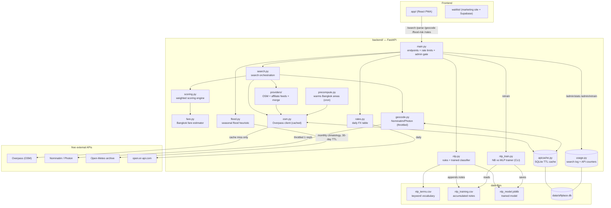

# SiftPlace — architecture

How the pieces connect. The frontend never computes matches itself — it calls
the FastAPI backend, which orchestrates the engine modules below. Every module
is fail-safe: on any upstream failure it degrades (cached/neutral/fallback
values) instead of raising.

## Reading the diagram

- **`main.py`** is the only entry point. It owns rate limits (slowapi), the
  optional Turnstile human check, the `/admin` token gate, and usage logging.
  It parses free-text notes via `nlp.py` and merges the result into the
  search preferences before calling `search.py`.
- **`search.py`** resolves the centre (`geocode.py`), widens the radius from
  the weight profile, gathers listings from `providers/` (OSM always;
  affiliate feeds when keys exist), fetches nearby POIs (`osm.py`), and ranks
  everything with `scoring.py` (which prices commutes via `fare.py`).
- **`nlp.py`** runs the keyword rules from `nlp_terms.csv` and, when
  `nlp_model.joblib` exists, unions in the trained classifier's predictions.
  Every submitted note is appended (weakly labelled) to `nlp_training.csv`;
  `nlp_train.py` refits Naive Bayes vs an MLP on it and saves the winner —
  in batches (CLI or `/admin/retrain`), never per request.
- **`flood.py`** is standalone — only the `/flood-risk` endpoint reaches it.
  It scores season + monthly heavy-rain likelihood + elevation.
- **`apicache.py` / `usage.py`** are the cross-cutting layers: every outbound
  fetch goes through the persistent cache first, and only REAL network calls
  increment the per-provider daily counters shown on `/admin`.
- **`precompute.py`** (run daily) warms the cache for the key Bangkok areas so
  live Overpass calls are the exception, not per-search.
